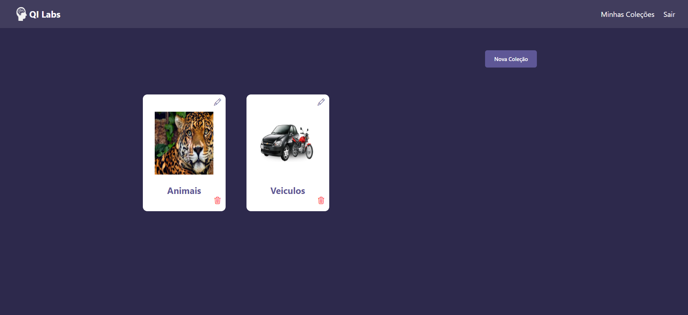
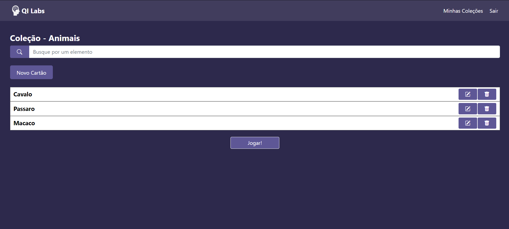

# Mind Booster

## Projeto criado para a matéria de Desenvolvimento Web 1

###  Tecnologias utilizadas

- ReactJs
- Firebase
- Redux
- React Router Dom
- Bootstrap
- HTML
- CSS

# Telas

## Inicio

## Login

## Cadastro

## Home

## Nova Coleção

## Cartão

## Novo Cartão

## Jogar

## Pontuação
